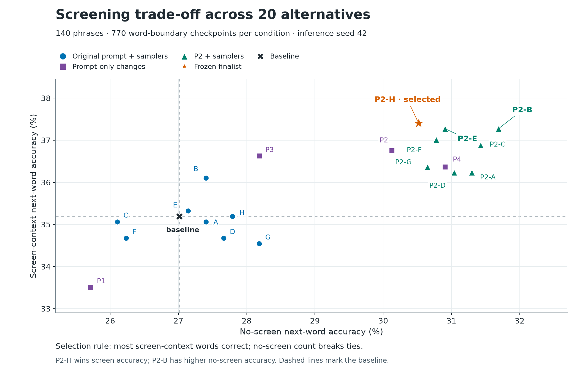
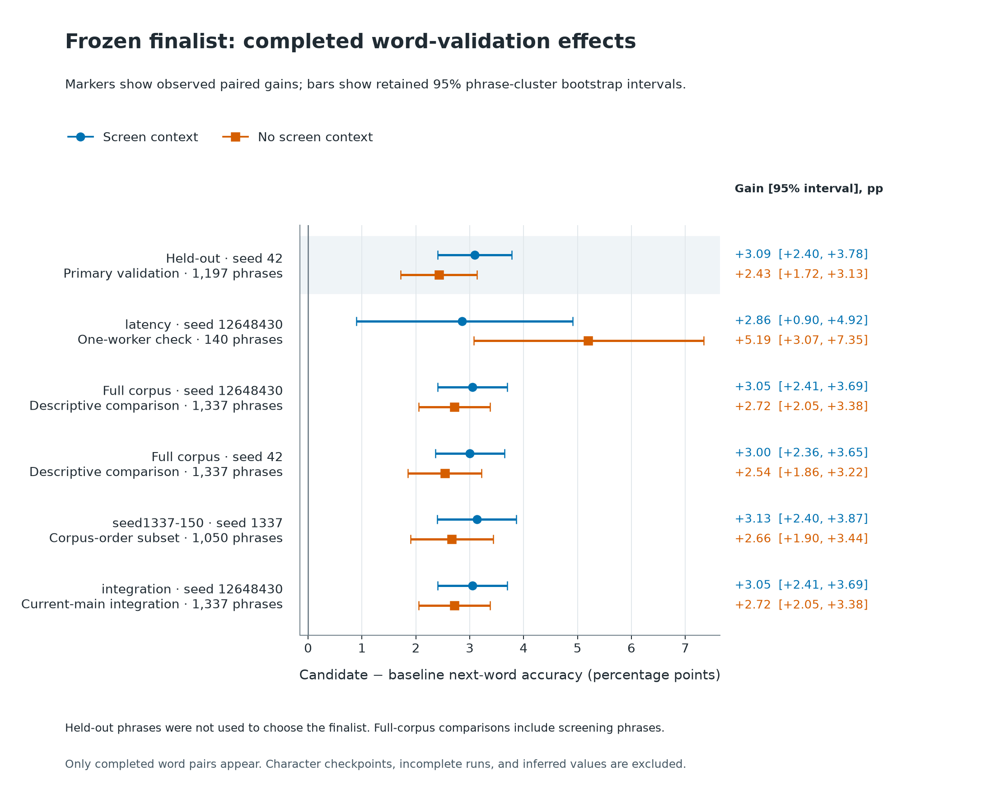

# Round figures

These plots illustrate recorded evidence. They do not change the frozen finalist or the explicit decision in `report.json`.



[Vector SVG](screening-tradeoff.svg). Every point is an observed screen/no-screen pair from the same 140 phrases; each axis uses 770 zero-letter word-boundary checkpoints. The selected P2-H, P2-B, and P2-E are labeled. Marker shape and color distinguish candidate families. Points are not jittered. Dashed lines locate the baseline. Screening scores informed selection, so this scatter is descriptive and is not independent validation.



[Vector SVG](validation-effects.svg). Accuracy is Swift’s authoritative `nextWord` correctness at zero-letter word boundaries. Gains are candidate minus baseline in percentage points. The shaded held-out row is the primary validation; full-corpus rows overlap screening and are descriptive checks at their stated seeds. The seed1337-150 row uses the first 150 corpus-order phrases per category (1,050 phrases, 5,782 checkpoints per condition); its size was chosen for remaining runtime and it also overlaps screening. Integration rows, if present, are labeled separately. Screen and no-screen observations are paired within a phrase. Recorded 95% intervals resample phrases within categories, retaining checkpoint dependence. They describe fixture uncertainty, not semantic quality or an acceptance/keystroke metric.

| Completed pair | Condition | Gain (pp) | 95% phrase interval (pp) |
|---|---|---:|---:|
| heldout42 | screen | +3.0898 | [+2.4044, +3.7778] |
| heldout42 | none | +2.4299 | [+1.7153, +3.1306] |
| latency | screen | +2.8571 | [+0.8963, +4.9159] |
| latency | none | +5.1948 | [+3.0749, +7.3454] |
| productionseed | screen | +3.0523 | [+2.4088, +3.6933] |
| productionseed | none | +2.7161 | [+2.0515, +3.3816] |
| full42 | screen | +2.9985 | [+2.3621, +3.6457] |
| full42 | none | +2.5413 | [+1.8561, +3.2210] |
| seed1337-150 | screen | +3.1304 | [+2.3961, +3.8655] |
| seed1337-150 | none | +2.6634 | [+1.9043, +3.4376] |
| integration | screen | +3.0523 | [+2.4088, +3.6933] |
| integration | none | +2.7161 | [+2.0515, +3.3816] |

The helper discovers only completed, error-free word pairs with retained paired analyses and 95% intervals. Character metrics and incomplete pairs are omitted; no missing results are interpolated. It verifies screening report hashes and counts, validates paired report identities/counts, and checks saved deltas against report aggregates. The plotted numbers and source hashes are retained in `plot-data.json`; output hashes, helper hash, and Matplotlib version are in `plot-provenance.json`.

Rerun from the repository with the retained round-local helper. The current round uses Python 3.12 in an isolated, ignored plotting environment because neither system nor bundled Python included Matplotlib. Use Python 3.12 when recreating it with the retained package versions:

```bash
python3 -m venv build/eval/round1-20260917/plot-venv
build/eval/round1-20260917/plot-venv/bin/python3 -m pip install -r benchmarks/phrase-prediction/round1-20260917/plot-requirements.txt
build/eval/round1-20260917/plot-venv/bin/python3 build/eval/round1-20260917/plot_round_results.py
```

The script writes only these chart files, `plot-data.json`, `plot-provenance.json`, and this document. It does not rerun models, update the report decision, or change source files. Its PNG and SVG share the same figure; SVG preserves text labels. Figures use the bundled DejaVu Sans font and distinguish conditions by both shape and color.
